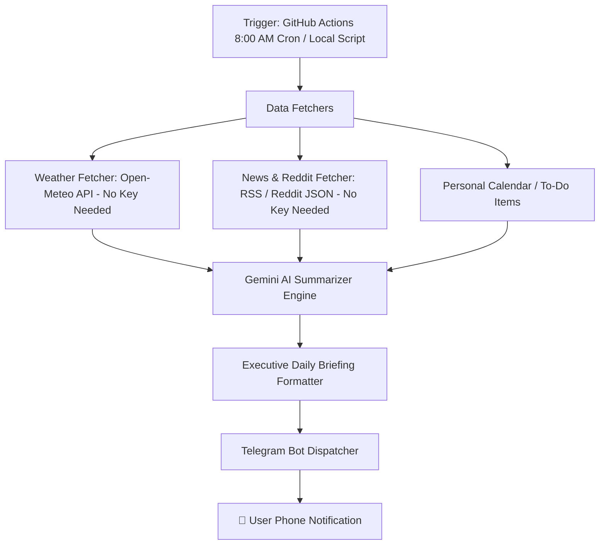

# Smart Daily Briefing AI Bot Implementation Plan

Build a fully-automated, zero-cost **AI Smart Daily Briefing Bot** in Python that aggregates daily information (news/Reddit, weather, custom topics, calendar/reminders), generates an executive AI summary using Google Gemini, and delivers it directly to your phone via Telegram every morning.

---

## Architecture Overview

---

## User Review Required

> [!IMPORTANT]
> **Free API Keys & Setup Needed:**
> 1. **Telegram Bot Token & Chat ID**: 100% free, takes 1 minute to create with `@BotFather` on Telegram.
> 2. **Gemini API Key**: Free tier from [Google AI Studio](https://aistudio.google.com/).
> 3. *Weather and News feeds require NO API keys.*

---

## Proposed Changes

### Core Bot Application

#### [NEW] [`requirements.txt`](file:///c:/Users/ad/OneDrive/Desktop/Test/requirements.txt)
Dependencies: `google-genai` (or `google-generativeai`), `requests`, `python-dotenv`, `feedparser`.

#### [NEW] [`.env.example`](file:///c:/Users/ad/OneDrive/Desktop/Test/.env.example)
Template for required environment variables:
- `GEMINI_API_KEY`
- `TELEGRAM_BOT_TOKEN`
- `TELEGRAM_CHAT_ID`
- `USER_CITY` (e.g. `New York`, `London`, `Tokyo`)
- `NEWS_TOPICS` / `RSS_FEEDS`

#### [NEW] [`config.py`](file:///c:/Users/ad/OneDrive/Desktop/Test/config.py)
Configuration loader and validator for environment variables with sensible fallback defaults.

#### [NEW] [`sources/weather.py`](file:///c:/Users/ad/OneDrive/Desktop/Test/sources/weather.py)
Fetches today's weather forecast, high/low temperatures, and precipitation probability for the user's city using Open-Meteo (zero API keys required).

#### [NEW] [`sources/news.py`](file:///c:/Users/ad/OneDrive/Desktop/Test/sources/news.py)
Fetches top headlines across customizable RSS feeds (e.g. TechCrunch, BBC, Hacker News, Reddit AI/Tech).

#### [NEW] [`ai_summarizer.py`](file:///c:/Users/ad/OneDrive/Desktop/Test/ai_summarizer.py)
Packages all collected context into a concise prompt for Gemini to generate a clean, emoji-styled executive morning briefing with actionable highlights.

#### [NEW] [`notifiers/telegram_notifier.py`](file:///c:/Users/ad/OneDrive/Desktop/Test/notifiers/telegram_notifier.py)
Sends the generated markdown message to the user's Telegram chat via Telegram's Bot HTTP API.

#### [NEW] [`main.py`](file:///c:/Users/ad/OneDrive/Desktop/Test/main.py)
Main entry point orchestrating the entire flow (fetching data $\rightarrow$ AI summarization $\rightarrow$ dispatching notification $\rightarrow$ error handling & logging).

---

### Cloud Automation (24/7 Free)

#### [NEW] [`.github/workflows/daily_briefing.yml`](file:///c:/Users/ad/OneDrive/Desktop/Test/.github/workflows/daily_briefing.yml)
GitHub Actions workflow configured with a daily cron trigger (e.g. 02:30 UTC / 8:00 AM local) that runs the Python script in the cloud for 100% free without needing your PC to stay on.

#### [NEW] [`README.md`](file:///c:/Users/ad/OneDrive/Desktop/Test/README.md)
Complete step-by-step setup guide with screenshots/instructions for creating the Telegram Bot, getting the Chat ID, getting the Gemini API key, and setting up GitHub Secrets.

---

## Verification Plan

### Automated / Local Tests
1. Verify module imports and dependency installation.
2. Test the Weather and News fetchers locally (verifying JSON structure and live network responses).
3. Test Gemini AI prompt generation and response formatting with mock data or live API key.
4. Test Telegram message dispatching with dry-run/preview mode.

### Manual Verification
1. Run `python main.py --dry-run` to view the briefing in the console without needing credentials.
2. Verify live delivery to Telegram when credentials are provided in `.env`.
